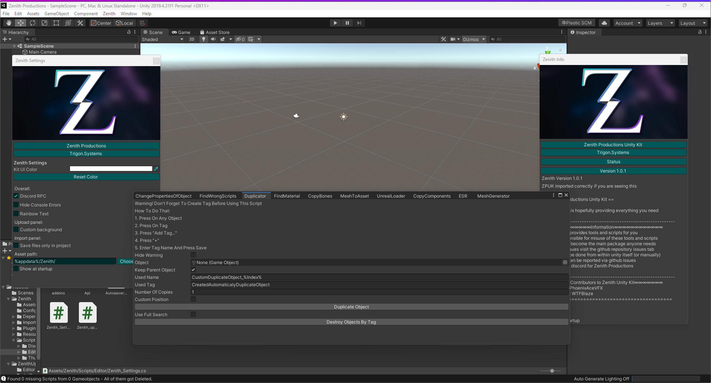

  

  
  

# IMPORT PANELS NONFUNCIONAL  
Yes I am very aware of this issue, I have yet to fix it as I do not have asset hosting currently  

# Zenith Unity Kit  
The Zenith Unity Kit is a new project designed to bring together anything you may need in Unity3D  
We have no target production for what you can use, as our target IS the Unity3D Engine  
There is no Discord Server for Zenith, Everything will be on the GitHub Repository  

  
  
  

# Full Screenshot  

# License

**This repository intentionally omits a supplementary license.** Exclusive copyright is held by the contributors.
The source code hosted in this repository may not be copied, distributed, or modified without risk of take-downs, shake-downs, or litigation.
For more information regarding the conditions of use where repositories omit a supplemental license; see [GitHub Terms of Service](https://docs.github.com/en/github/site-policy/github-terms-of-service#d-user-generated-content), or [the summary of 'No License' conditions](https://choosealicense.com/no-permission/).

